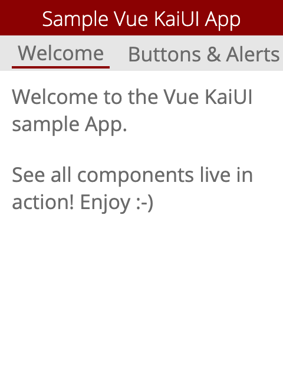
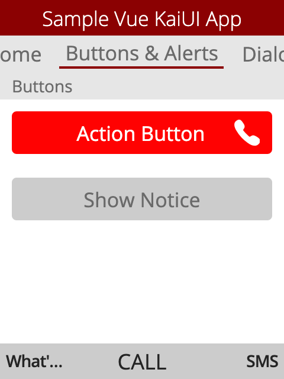
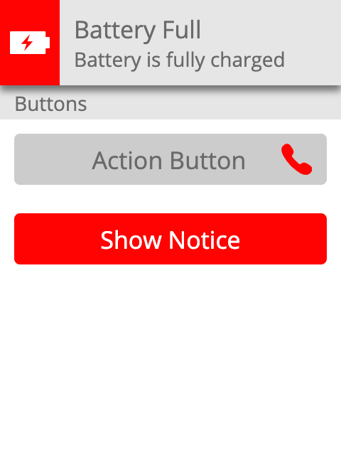
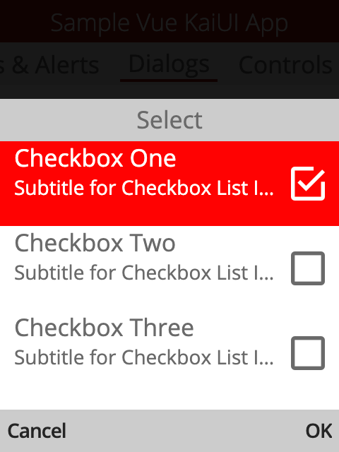
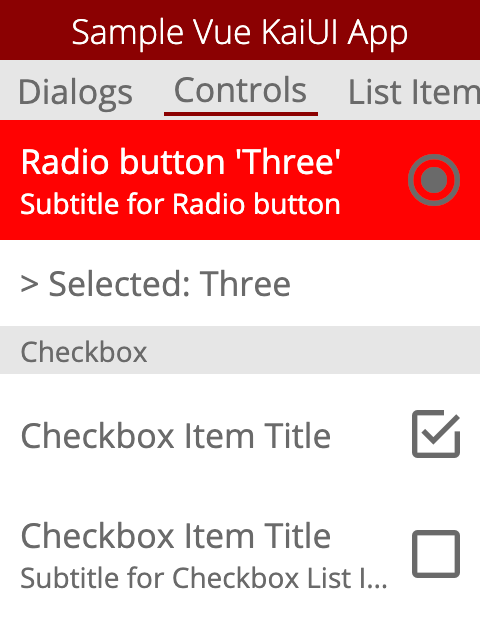

# Sample [Vue KaiUI](https://github.com/sebastianbaar/vue-kaiui) App for KaiOS

Sample Vue KaiUI App for KaiOS. 
For more information about the Vue component library for KaiOS apps visit [Vue KaiUI](https://github.com/sebastianbaar/vue-kaiui).

<table>
  <tr>
    <td></td>
    <td></td>
    <td></td>
  </tr>
  <tr>
    <td></td>
    <td></td>
  </tr>
</table>

## Start

```console
npm run serve
```

## Build app

```console
npm run build
```
